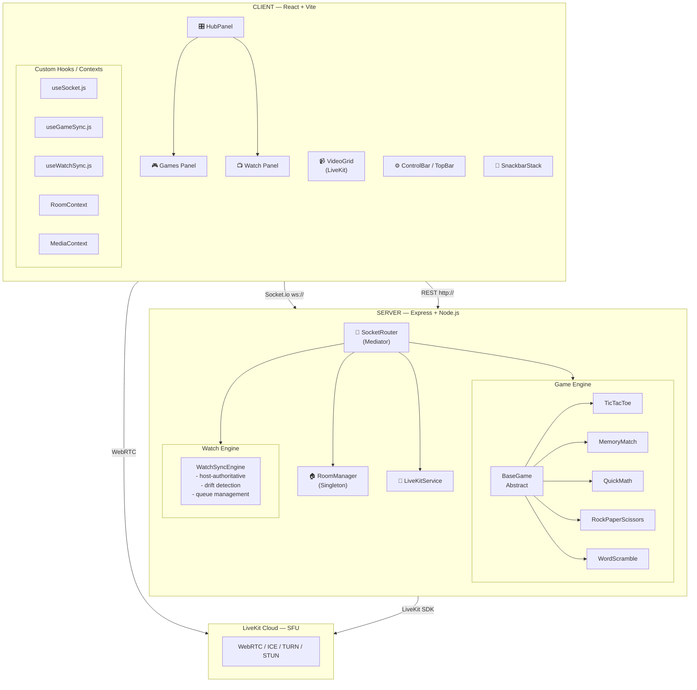
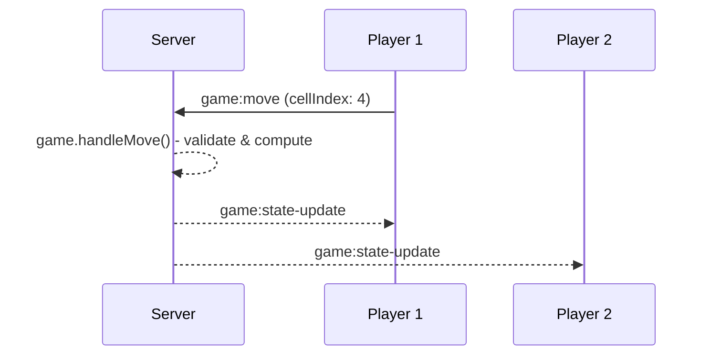
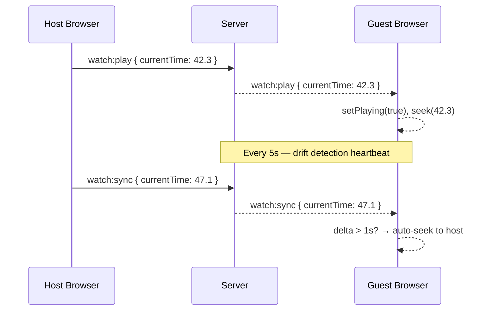
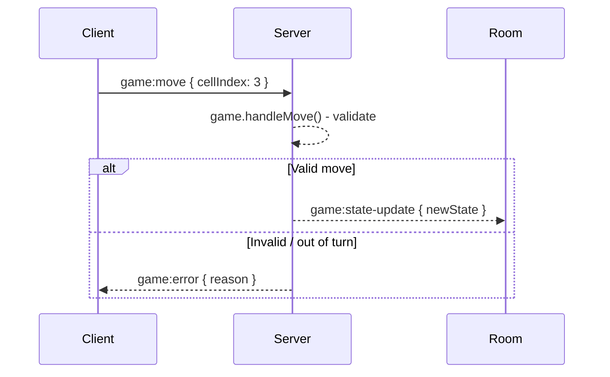

<div align="center">

# 🎮 PlayTogether

**Real-time collaborative platform — video calls, multiplayer games, and synchronized watch parties in one.**

[](https://reactjs.org/)
[](https://vitejs.dev/)
[](https://socket.io/)
[](https://livekit.io/)
[](https://nodejs.org/)
[](https://www.framer.com/motion/)

</div>

---

## ✨ Overview

PlayTogether is a Google Meet-inspired collaboration platform that layers real-time multiplayer mini-games and synchronized watch parties directly onto a video call, without leaving the room. Built with a fully decoupled monorepo architecture and a host-authoritative synchronization model, it keeps all participants in lockstep across high-latency connections.

### Core Features

| Feature | Description |
|---|---|
| 📹 **Video Calls** | Full multi-party WebRTC video via LiveKit SFU with speaking indicators |
| 🎮 **5 Mini-Games** | Tic Tac Toe, Memory Match, Quick Math, Rock Paper Scissors, Word Scramble |
| 📺 **Watch Party** | Host-synchronized YouTube/video playback with queue and reactions |
| ⚡ **Real-Time Sync** | Socket.io 4 for game state, watch sync, queue management, and reactions |
| ♿ **Accessible** | WCAG 2.1 AA compliant — full keyboard nav, `aria-label`s, focus rings |
| 📱 **Responsive** | Mobile landscape-aware with iOS safe area inset support |

---

## 🏗️ System Architecture



---

## 🧠 OOP Design Patterns

The server-side game engine is a textbook exercise in classical OOP and SOLID principles.

### Abstract Base Class & Polymorphism

All five games extend a common `BaseGame` abstract class that defines a rigid, polymorphic interface:

```js
// server/src/game/BaseGame.js
class BaseGame {
  start(players)         { throw new Error('Not implemented'); }
  handleMove(playerId, move) { throw new Error('Not implemented'); }
  getState()             { throw new Error('Not implemented'); }
  isGameOver()           { throw new Error('Not implemented'); }
  reset()                { throw new Error('Not implemented'); }
}
```

Each game (e.g., `TicTacToe`, `MemoryMatch`) **overrides** these methods with their own rules. The `SocketRouter` treats every game identically through this shared interface — it never checks `if game === 'tic-tac-toe'`.

### Factory Pattern

The `GameFactory` class encapsulates object creation, decoupling the socket router from concrete game implementations. Adding a new game requires **zero changes** to the router:

```js
// server/src/game/GameFactory.js
class GameFactory {
  static create(gameType) {
    const games = {
      'tic-tac-toe':         () => new TicTacToe(),
      'memory-match':        () => new MemoryMatch(),
      'quick-math':          () => new QuickMath(),
      'rock-paper-scissors': () => new RockPaperScissors(),
      'word-scramble':       () => new WordScramble(),
    };
    if (!games[gameType]) throw new Error(`Unknown game: ${gameType}`);
    return games[gameType]();
  }
}
```

### Singleton Pattern

`RoomManager` is instantiated once at server startup and injected into the `SocketRouter`. It maintains a single authoritative `Map<roomCode, Room>` preventing any split-brain state across concurrent socket connections:

```js
// server/src/services/RoomManager.js
class RoomManager {
  constructor() {
    this.rooms = new Map(); // Single source of truth
  }
  createRoom(code) { ... }
  addParticipant(code, participant) { ... }
  removeParticipant(code, socketId) { ... }
}
```

### Mediator Pattern

`SocketRouter` acts as a central event mediator. No game handler or watch handler ever talks to another handler directly — all communication is mediated through the router:

```js
// server/src/socket/SocketRouter.js
class SocketRouter {
  constructor(io, roomManager) {
    this.io = io;
    this.roomManager = roomManager;
  }
  initializeHandlers(socket) {
    socket.on('room:join',    (d) => this.handleRoomJoin(socket, d));
    socket.on('game:start',   (d) => this.handleGameStart(socket, d));
    socket.on('game:move',    (d) => this.handleGameMove(socket, d));
    socket.on('watch:play',   (d) => this.handleWatchPlay(socket, d));
    socket.on('watch:react',  (d) => this.handleWatchReact(socket, d));
    // ...
  }
}
```

### Strategy Pattern

Each game implements its own move validation and state computation strategy. The `SocketRouter` calls `game.handleMove(playerId, move)` — the concrete *strategy* for what that means differs per game completely independently:

- **TicTacToe**: validates cell is empty, checks 8 win conditions
- **MemoryMatch**: validates card is unflipped, resolves pair matches
- **QuickMath**: validates answer string against computed solution

### Observer Pattern (via Socket.io)

Socket.io's event emitter architecture is a natural Observer implementation. Room participants *subscribe* to events like `game:state-update`. When the server calls `io.to(roomCode).emit(...)`, all observers receive the state delta simultaneously:



---

## 🔄 SOLID Principles Mapping

| Principle | Where Applied |
|---|---|
| **Single Responsibility** | `RoomManager` manages rooms, `WatchSyncEngine` manages watch state, `LiveKitService` manages tokens — each class has exactly one reason to change |
| **Open/Closed** | New games are added by creating a new `BaseGame` subclass and a `GameFactory` entry. Existing code is never modified |
| **Liskov Substitution** | Any `BaseGame` subclass can replace another in the `SocketRouter` without breaking behavior — all honor the same interface contract |
| **Interface Segregation** | Clients receive only the state slices they need (`game:state-update` vs `watch:sync`) rather than one monolithic broadcast |
| **Dependency Inversion** | `SocketRouter` depends on the `RoomManager` abstraction injected at construction, not a `new RoomManager()` call internally |

---

## ⚡ Real-Time Synchronization Design

### Host-Authoritative Watch Sync

The watch party uses a **host-authoritative** model. Only the host's play/pause/seek events propagate to other viewers. This prevents desync from concurrent conflicting commands:



### Game State Authority

Game moves follow a **server-authoritative** flow:



All clients render the server-confirmed state — never the client's optimistic version. This prevents desync and cheating simultaneously.

### Ephemeral Reactions

Emoji reactions are intentionally **not persisted** in `WatchSyncEngine`. They are pure fire-and-forget broadcasts: the server receives `watch:react`, immediately fans it out to the room, and forgets. This minimizes server memory and eliminates the need for cleanup logic.

---

## 📦 Tech Stack

### Frontend

| Technology | Role |
|---|---|
| **React 19** | UI component tree, state management via hooks |
| **Vite 8** | Lightning-fast dev server and ESM bundler |
| **Tailwind CSS 4** | Utility-first styling and responsive breakpoints |
| **Framer Motion** | Floating reaction animations, AnimatePresence list transitions |
| **Socket.io-client** | Real-time bidirectional WebSocket communication |
| **@livekit/components-react** | Pre-built WebRTC video grid components |
| **react-player** | Universal YouTube / video URL player abstraction |

### Backend

| Technology | Role |
|---|---|
| **Node.js + Express** | HTTP server, REST API endpoints |
| **Socket.io 4** | WebSocket server, room-scoped event broadcasting |
| **livekit-server-sdk** | LiveKit JWT access token generation |
| **CORS** | Cross-origin request handling for client—server separation |

### Infrastructure

| Service | Role |
|---|---|
| **LiveKit Cloud** | Multi-party SFU for WebRTC — handles TURN/STUN/ICE negotiation |
| **Vercel** | Frontend static hosting with automatic CI/CD from GitHub |
| **Render** | Backend Node.js hosting with persistent WebSocket support |

---

## 📁 Project Structure

```
PlayTogether/
├── client/                          # React + Vite frontend
│   ├── public/
│   │   └── favicon.svg
│   ├── src/
│   │   ├── main.jsx                 # Entry point
│   │   ├── App.jsx                  # Router: Landing / PreJoin / Room
│   │   ├── index.css                # Design system tokens + global CSS
│   │   ├── contexts/
│   │   │   ├── RoomContext.jsx      # Room state (participants, host, hub)
│   │   │   ├── MediaContext.jsx     # Camera/mic preferences
│   │   │   └── SnackbarContext.jsx  # Global notification queue
│   │   ├── hooks/
│   │   │   ├── useSocket.js         # Socket.io lifecycle + event subscription
│   │   │   ├── useGameSync.js       # Game state machine via socket
│   │   │   └── useWatchSync.js      # Watch playback sync + queue
│   │   └── components/
│   │       ├── ui/                  # Design system primitives
│   │       │   ├── ControlButton.jsx
│   │       │   ├── Avatar.jsx
│   │       │   ├── Tooltip.jsx
│   │       │   └── Snackbar.jsx
│   │       ├── shell/               # App chrome
│   │       │   ├── LandingPage.jsx
│   │       │   ├── PreJoinScreen.jsx
│   │       │   ├── RoomPage.jsx     # Main in-room layout
│   │       │   ├── HubPanel.jsx     # Games / Watch panel container
│   │       │   ├── HubSwitcher.jsx
│   │       │   └── ParticipantsDrawer.jsx
│   │       ├── video/
│   │       │   ├── VideoGrid.jsx    # LiveKit participant layout
│   │       │   └── VideoTile.jsx    # Single participant tile + speaking ring
│   │       ├── game/
│   │       │   ├── TicTacToeBoard.jsx
│   │       │   ├── MemoryMatchBoard.jsx
│   │       │   ├── QuickMathBoard.jsx
│   │       │   ├── RPSBoard.jsx
│   │       │   ├── WordScrambleBoard.jsx
│   │       │   ├── ScoreHeader.jsx
│   │       │   ├── GameSelector.jsx
│   │       │   └── GameOverOverlay.jsx
│   │       └── watch/
│   │           ├── WatchPanel.jsx
│   │           ├── VideoPlayer.jsx
│   │           ├── ReactionBar.jsx
│   │           ├── FloatingReactions.jsx
│   │           └── QueuePanel.jsx
│   ├── index.html
│   ├── vite.config.js
│   └── package.json
│
└── server/                          # Node.js + Express backend
    ├── src/
    │   ├── index.js                 # Server entry, CORS, Socket.io init
    │   ├── config/
    │   │   └── index.js             # Env vars (PORT, LIVEKIT_*)
    │   ├── routes/
    │   │   ├── roomRoutes.js        # POST /api/rooms, GET /api/rooms/:code
    │   │   └── livekitRoutes.js     # POST /api/livekit/token
    │   ├── services/
    │   │   ├── RoomManager.js       # Room CRUD + participant tracking (Singleton)
    │   │   └── LiveKitService.js    # JWT token generation
    │   ├── game/
    │   │   ├── BaseGame.js          # Abstract game interface
    │   │   ├── GameFactory.js       # Factory pattern
    │   │   ├── TicTacToe.js
    │   │   ├── MemoryMatch.js
    │   │   ├── QuickMath.js
    │   │   ├── RockPaperScissors.js
    │   │   └── WordScramble.js
    │   ├── sync/
    │   │   └── WatchSyncEngine.js   # Host-authoritative video sync + queue
    │   ├── socket/
    │   │   └── SocketRouter.js      # Mediator: all socket event dispatch
    │   └── utils/
    │       └── generateRoomCode.js
    └── package.json
```

---

## 🎮 Socket.io Event Reference

### Room Events

| Event | Direction | Payload | Description |
|---|---|---|---|
| `room:join` | Client → Server | `{ roomCode, displayName }` | Join or create a room |
| `room:leave` | Client → Server | — | Leave current room |
| `room:joined` | Server → Client | `{ participants, hostId, activeHub }` | Emitted to joiner on success |
| `room:participant-joined` | Server → Room | `{ participant, participants }` | Broadcast to others on new join |
| `room:participant-left` | Server → Room | `{ participants, hostId }` | Broadcast on participant disconnect |
| `room:error` | Server → Client | `{ message }` | Error feedback (room full, invalid code) |
| `room:set-hub` | Client → Server | `{ activeHub }` | Host switches active hub |
| `room:hub-updated` | Server → Room | `{ activeHub }` | Broadcast hub switch to all participants |

### Game Events

| Event | Direction | Payload | Description |
|---|---|---|---|
| `game:start` | Client → Server | `{ gameType }` | Host starts a game |
| `game:move` | Client → Server | `{ move }` | Player submits a move |
| `game:state-update` | Server → Room | `{ gameState }` | Authoritative state broadcast |
| `game:reset` | Client → Server | — | Reset current game |
| `game:exit` | Client → Server | — | Exit game back to lobby |

### Watch Events

| Event | Direction | Payload | Description |
|---|---|---|---|
| `watch:play` | Client → Server | `{ currentTime }` | Host plays video |
| `watch:pause` | Client → Server | `{ currentTime }` | Host pauses video |
| `watch:seek` | Client → Server | `{ currentTime }` | Host seeks to timestamp |
| `watch:load-url` | Client → Server | `{ url }` | Host loads a new video URL |
| `watch:sync` | Server → Room | `{ isPlaying, currentTime, url }` | Sync heartbeat to all guests |
| `watch:queue-add` | Client → Server | `{ url, addedBy }` | Add URL to shared queue |
| `watch:queue-remove` | Client → Server | `{ id }` | Remove item from queue |
| `watch:queue-dequeue` | Client → Server | — | Host plays next queue item |
| `watch:react` | Client → Server | `{ emoji }` | Send emoji reaction |

---

## 🎨 Design System

PlayTogether follows **Material Design 3** semantics with Google Meet's dark-first video surface aesthetic.

### Color Palette

```css
--color-video-surface: #202124;   /* Dark video background */
--color-control-bar:   #3C4043;   /* Control bar surface */
--color-blue:          #1857D9;   /* Primary brand + focus ring */
--color-green:         #0F9D58;   /* Speaking ring + success */
--color-red:           #D93025;   /* Leave call + danger */
--color-cyan:          #00BCD4;   /* Watch sync badge */
--color-amber:         #F29900;   /* Out-of-sync warning */
```

### Animation Spec

| Animation | Duration | Easing |
|---|---|---|
| Speaking ring pulse | 1200ms | ease-in-out infinite |
| Score bump | 400ms | cubic-bezier(0.34, 1.56, 0.64, 1) |
| Card hover lift | 150ms | ease-out |
| Hub panel slide | 300ms | ease-standard |
| Floating reaction | 1500ms | ease-out |
| Snackbar slide-in | 250ms | ease-decelerate |

---

## 🚀 Getting Started

### Prerequisites

- Node.js ≥ 18
- A [LiveKit Cloud](https://cloud.livekit.io/) account (free tier works)

### 1. Clone & Install

```bash
git clone https://github.com/vingoel26/PlayTogether.git
cd PlayTogether
npm install
```

### 2. Environment Variables

**`server/.env`**

```env
PORT=3001
CLIENT_URL=http://localhost:5173
LIVEKIT_API_KEY=your_livekit_api_key
LIVEKIT_API_SECRET=your_livekit_api_secret
LIVEKIT_URL=wss://your-project.livekit.cloud
```

**`client/.env`**

```env
VITE_SERVER_URL=http://localhost:3001
VITE_LIVEKIT_WS_URL=wss://your-project.livekit.cloud
```

### 3. Run Locally

```bash
# Terminal 1 — Backend
cd server && npm run dev

# Terminal 2 — Frontend  
cd client && npm run dev
```

Open `http://localhost:5173` in two browser tabs and create/join a room!

---

## 🌐 Deployment

### Frontend → Vercel

```bash
cd client
npm run build
# or connect GitHub repo to Vercel dashboard
```

Set environment variables in Vercel dashboard:

- `VITE_SERVER_URL` → your Render backend URL
- `VITE_LIVEKIT_WS_URL` → your LiveKit Cloud WSS URL

### Backend → Render

1. Create a **Web Service** on [Render](https://render.com)
2. Connect your GitHub repo, set root directory to `server/`
3. Build command: `npm install`
4. Start command: `npm start`
5. Set all env vars from `server/.env`

> **Important**: Render's free tier supports persistent WebSocket connections. Ensure the plan you select does not have request timeout limits shorter than your average session length.

---

## 🔐 Security Considerations

- **LiveKit tokens** are short-lived JWTs generated server-side and never exposed in client code
- **Room codes** are 9-character random strings — not guessable but not secret (share with intent)
- **Host authority**: Only the host can start games, change hubs, or control video playback. All guard checks live server-side in `SocketRouter.js`
- **Max room size**: Enforced server-side at 8 participants — the 9th connection is rejected before any state mutation
- **CORS**: Configured to only allow requests from the known client origin

---

## future scope

- [ ] **E6**: Production deployment hardening (HTTPS, CSP headers, rate limiting)
- [ ] **Auth**: User accounts, persistent room history (Auth.js + PostgreSQL)
- [ ] **Spectator Mode**: Join a room in view-only mode without a video tile
- [ ] **Screen Share**: Leverage LiveKit's screen-share track for presentations
- [ ] **Chat**: Persistent room chat panel alongside the video call
- [ ] **More Games**: Chess, Wordle, Codenames word game integration

---
